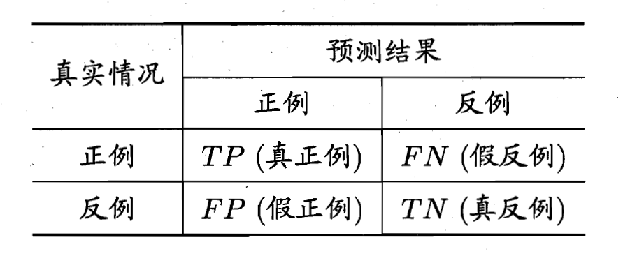

## 性能度量

### 混淆矩阵

混淆矩阵（Confusion Matrix）又被称为错误矩阵，通过它可以直观地观察到算法的效果。它的每一列是样本的预测分类，每一行是样本的真实分类（反过来也可以），顾名思义，它反映了分类结果的混淆程度。混淆矩阵 i 行 j 列的原始是原本是类别 i 却被分为类别 j 的样本个数，计算完之后还可以对之进行可视化：

- 真阳性（True Positive，TP）：指被分类器正确分类的正例数据
- 真阴性（True Negative，TN）：指被分类器正确分类的负例数据
- 假阳性（False Positive，FP）：被错误地标记为正例数据的负例数据
- 假阴性（False Negative，FN）：被错误地标记为负例数据的正例数据

假设：

target ： 0 0 0 0 1 1 1 1 1 1

predict：0 1 0 1 0 1 0 1 0 0

精度： 4/10=0.4

准确率：2/4=0.5

召回率：2/6=0.33

精度（Accuracy）：
$$
Acc = \frac{TP+TN}{TP+TN+FN+FP}
$$
准确率（Precision）：模型判为正的所有样本中有多少是真正的正样本
$$
P = \frac{TP}{TP+FP}
$$
召回率（Recall）：所有正样本有多少被模型判为正样本
$$
R = \frac{TP}{TP+FN}
$$
有时候我们需要在精确率与召回率间进行权衡，一种选择是画出精确率-召回率曲线（Precision-Recall Curve），曲线下的面积被称为AP分数（Average precision score）；

另外一种选择是计算$F_{\beta}$分数：
$$
F_{\beta} = (1+\beta^2)\cdot \frac{P+R}{\beta^2 \cdot P + R}
$$
ROC曲线适用于二分类问题，以假正率为横坐标，真正率为纵坐标的曲线图，如：

AUC分数是曲线下的面积（Area under curve），越大意味着分类器效果越好。显然这个面积的数值不会大于1。又由于ROC曲线一般都处于y=x这条直线的上方，所以AUC的取值范围在0.5和1之间。使用AUC值作为评价标准是因为很多时候ROC曲线并不能清晰的说明哪个分类器的效果更好，而作为一个数值，对应AUC更大的分类器效果更好。

ROC和AUC的优点：既然已经这么多评价标准，为什么还要使用ROC和AUC呢？因为ROC曲线有个很好的特性：当测试集中的正负样本的分布变化的时候，ROC曲线能够保持不变。在实际的数据集中经常会出现类不平衡（class imbalance）现象，即负样本比正样本多很多（或者相反），而且测试数据中的正负样本的分布也可能随着时间变化。

### Lift（提升）和Gain（增益）

判定方法：lift应一直大于1.
$$
Lift = \frac{TN}{FN+TN}\cdot \frac{FP+TN}{TP+FP+FN+TN}
$$
它衡量的是，与不用模型相比，模型的预测能力提升了多少。不利用模型，我们只能利用正例的比例$\frac{FP+TN}{TP+FP+FN+TN}$这个样本信息来估计正例的比例(baseline model),而利用模型之后，只需要从我们预测为正例的那个样本的子集(FN+TN)中挑选正例，这时预测的准确率为$\frac{TN}{FN+TN}$.

由此可见，lift(提升指数)越大，模型的预测效果越好。如果这个模型的预测能力跟baseline model一样，那么这个模型就没有任何意义。

一个好的分类模型，就是要偏离baseline model足够远。在lift图中，表现就是，在depth为1之前，lift一直保持较高的(大于1的)数值，也即曲线足够陡峭。

Gain与Lift相当类似，Gain chart是不同阈值下d/b+d的轨迹，与Lift的区别就在于纵轴刻度的不同。

### 基尼系数

Gini ＝ 2*AUC － 1

##  评估方法

### 训练集 vs. 测试集

在模式识别（pattern recognition）与机器学习（machine learning）的相关研究中，经常会将数据集（dataset）分为训练集（training set）跟测试集（testing set）这两个子集，前者用以建立模型（model），后者则用来评估该模型对未知样本进行预测时的精确度，正规的说法是泛化能力（generalization ability）。怎么将完整的数据集分为训练集跟测试集，必须遵守如下要点：

1. 只有训练集才可以用在模型的训练过程中，测试集则必须在模型完成之后才被用来评估模型优劣的依据。
2. 训练集中样本数量必须够多，一般至少大于总样本数的50%。
3. 两组子集必须从完整集合中均匀取样。

### 交叉验证法（Cross Validation，CV）

#### K折交叉验证

例如当K=10时，在原始数据A的基础上，我们随机抽取一组观测，构成一个数据子集（容量固定）,记为A1A1 重复以上过程10次，我们就会获得一个数据子集集合 {A1,A2,A3,A4,A5,A6,A7,A8,A9,A10}，接下来，我们首先对模型M1进行交叉验证，如下：

- 在{A2,A3,A4,A5,A6,A7,A8,A9,A10}基础上构建模型M1，并对数据集A1进行验证，将预测值与真值进行比较，在某一评价标准下，计算一个得分a1,1.
- 在{A1,A3,A4,A5,A6,A7,A8,A9,A10}基础上构建模型M，并对数据集A2进行验证，将预测值与真值进行比较，在同一评价标准下，计算一个得分a1,2.
- ……
- 在{A1,A2,A3,A4,A5,A6,A7,A8,A9}基础上构建模型，并对数据集A10进行验证，将预测值与真值进行比较，在同一评价标准下，计算一个得分a1,10.
- a1=a1,1+a1,2+…+a1/10作为模型M1的综合得分。

#### Hold out法

 将原始数据随机分为两组，一组做为训练集，一组做为验证集，利用训练集训练分类器，然后利用验证集验证模型，记录最后的分类准确率为此分类器的性能指标。此种方法的好处的处理简单，只需随机把原始数据分为两组即可，其实严格意义来说Hold-Out Method并不能算是CV，因为这种方法没有达到交叉的思想，由于是随机的将原始数据分组，所以最后验证集分类准确率的高低与原始数据的分组有很大的关系，所以这种方法得到的结果其实并不具有说服性。

#### 留一法**Leave-One-Out **

如果设原始数据有N个样本，那么LOO-CV就是N-CV，即每个样本单独作为验证集，其余的N-1个样本作为训练集，所以LOO-CV会得到N个模型，用这N个模型最终的验证集的分类准确率的平均数作为此下LOO-CV分类器的性能指标。相比于前面的K-CV，LOO-CV有两个明显的优点：

- 每一回合中几乎所有的样本皆用于训练模型，因此最接近原始样本的分布，这样评估所得的结果比较可靠。
- 实验过程中没有随机因素会影响实验数据，确保实验过程是可以被复制的。

但LOO-CV的缺点则是计算成本高，因为需要建立的模型数量与原始数据样本数量相同，当原始数据样本数量相当多时，LOO-CV在实作上便有困难几乎就是不显示，除非每次训练分类器得到模型的速度很快，或是可以用并行化计算减少计算所需的时间。