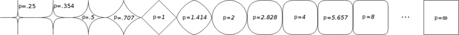
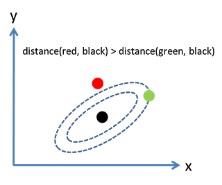
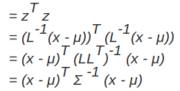
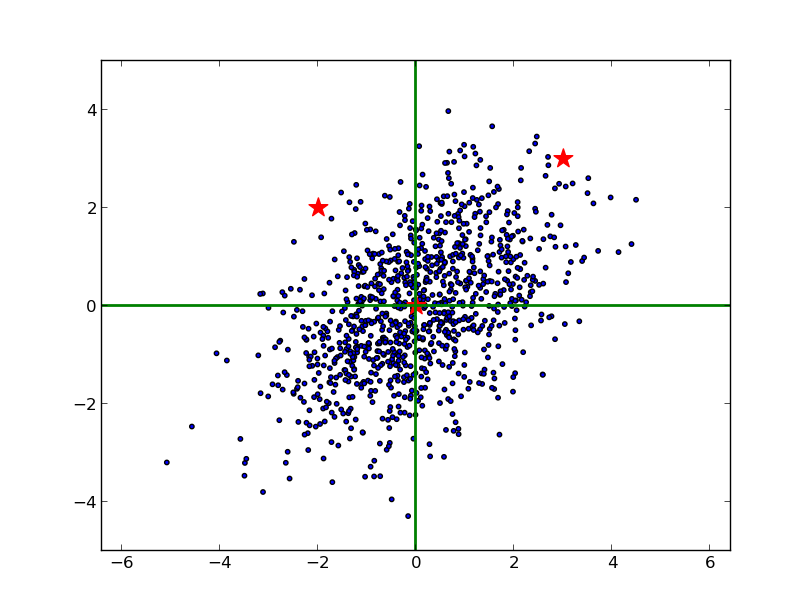
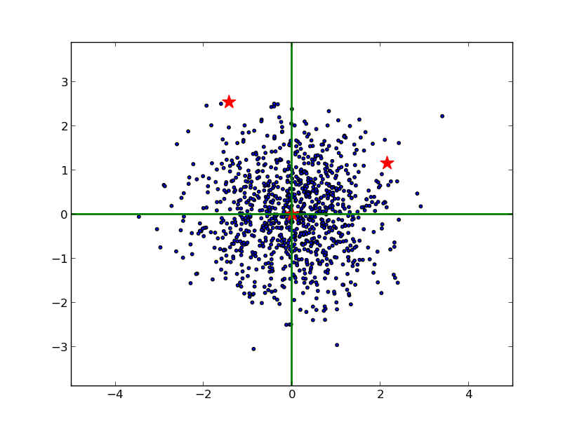
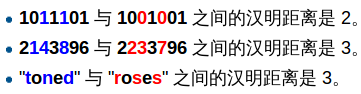
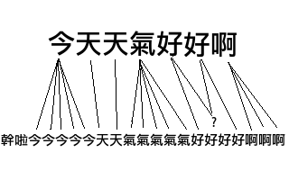

# 距离与相似性度量方法

在机器学习和数据挖掘中，我们经常需要知道个体间差异的大小，进而评价个体的相似性和类别。如数据挖掘中的分类与聚类算法。根据数据特性的不同，需要采用不同的度量方法。

一个距离函数d(x,y)需要满足以下原则：

1. 到自身的距离为0：d(x,x) = 0
2. 距离非负：d(x,y) >= 0
3. 对称性：d(x,y) = d(y,x)
4. 三角形法则：d(x,k) + d(k,y)> d(x,y)

常用的距离（相似度）度量方法：

1. **闵可夫斯基距离**（Minkowski distance）
2. **欧几里得距离**（Euclidean distance）
3. **曼哈顿距离**（Manhattan distance）
4. **切比雪夫距离**（Chebyshev distance）
5. **马氏距离**（Mahalanobis distance）
6. **余弦相似度**（Cosine similarity）
7. **皮尔逊相关系数**（Pearson correlation）
8. **汉明距离**（Hamming distance）
9. **杰卡德相似系数**（Jaccard similarity）
10. **编辑距离**（Edit distance, Levenshtein distance）
11. **DTW 距离**（Dynamic Time Warp）
12. **KL 散度**（ KL-Divergence）

###  闵可夫斯基距离

设数值点$P=(x_1,x_2...x_n),\ Q=(y_1,y_2...y_n) \in \mathbb{R}^n$，则其闽科夫斯基距离定义为：
$$
D=(\sum_{i=1}^n|x_i-y_i|^p)^{1/p}
$$

- 当p=1时，即为曼哈顿距离
- 当p=2时，即为欧几里得距离
- 当p趋于无穷大时，即为切比雪夫距离：

$$
\mathop{\lim}\limits_{p \to \infty} =(\sum_{i=1}^n|x_i-y_i|^p)^{1/p} = \mathop{\max}_{i=1}^n|x_i-y_i|
$$

平面上原点到欧式距离（p=1）为1的点组成圆形，当p取其他数值的形状：



> 当 p `<` 1 时，闵可夫斯基距离不再符合三角形法则，举个例子：当 p `<` 1, (0,0) 到 (1,1) 的距离等于 (1+1)^{1/p} `>` 2, 而 (0,1) 到这两个点的距离都是 1。

闵可夫斯基距离比较直观，但是它与数据的分布无关，具有一定的局限性，如果 x 方向的幅值远远大于 y 方向的值，这个距离公式就会过度放大 x 维度的作用。所以，在计算距离之前，我们可能还需要对数据进行 **z-transform** 处理，即减去均值，除以标准差：
$$
(x_1,y_1) \to (\frac{x_1-\mu}{\sigma_x}, \frac{y_1-\mu_y}{\sigma_y})
$$

### 马氏距离

可以看到，上述处理开始体现数据的统计特性了。这种方法在假设数据各个维度不相关的情况下利用数据分布的特性计算出不同的距离。如果维度相互之间数据相关（例如：身高较高的信息很有可能会带来体重较重的信息，因为两者是有关联的），这时候就要用到马氏距离了。

考虑下面这张图，椭圆表示等高线，从欧几里得的距离来算，绿黑距离大于红黑距离，但是从马氏距离，结果恰好相反：



马氏距离实际上是利用 Cholesky transformation 来消除不同维度之间的**相关性**和**尺度不同**的性质。假设样本点（列向量）之间的协方差对称矩阵是$\sum$，通过 Cholesky Decomposition（实际上是对称矩阵 LU 分解的一种特殊形式）可以转化为下三角矩阵和上三角矩阵的乘积： $\sum = LL^T$。消除不同维度之间的相关性和尺度不同，只需要对样本点 x 做如下处理：
$$
z = L^{-1}(x-\mu)
$$
处理之后的欧几里得距离就是原样本的马氏距离(为了书写方便，这里求马氏距离的平方)：



下图蓝色表示原样本点的分布，两颗红星坐标分别是（3, 3），（2, -2）:



由于 x， y 方向的尺度不同，不能单纯用欧几里得的方法测量它们到原点的距离。并且，由于 x 和 y 是相关的（大致可以看出斜向右上），也不能简单地在 x 和 y 方向上分别减去均值，除以标准差。最恰当的方法是对原始数据进行 Cholesky 变换，即求马氏距离（可以看到，右边的红星离原点较近）：



```python
 
import numpy as np
import pylab as pl
import scipy.spatial.distance as dist
 
def plotSamples(x, y, z=None):
 
    stars = np.matrix([[3., -2., 0.], [3., 2., 0.]])
    if z is not None:
        x, y = z * np.matrix([x, y])
        stars = z * stars
 
    pl.scatter(x, y, s=10)    # 画 gaussian 随机点
    pl.scatter(np.array(stars[0]), np.array(stars[1]), s=200, marker='*', color='r')  # 画三个指定点
    pl.axhline(linewidth=2, color='g') # 画 x 轴
    pl.axvline(linewidth=2, color='g')  # 画 y 轴
 
    pl.axis('equal')
    pl.axis([-5, 5, -5, 5])
    pl.show()
 
# 产生高斯分布的随机点
mean = [0, 0]      # 平均值
cov = [[2, 1], [1, 2]]   # 协方差
x, y = np.random.multivariate_normal(mean, cov, 1000).T
plotSamples(x, y)
 
covMat = np.matrix(np.cov(x, y))    # 求 x 与 y 的协方差矩阵
Z = np.linalg.cholesky(covMat).I  # 仿射矩阵
plotSamples(x, y, Z)
 
# 求马氏距离 
print '\n到原点的马氏距离分别是：'
print dist.mahalanobis([0,0], [3,3], covMat.I), dist.mahalanobis([0,0], [-2,2], covMat.I)
 
# 求变换后的欧几里得距离
dots = (Z * np.matrix([[3, -2, 0], [3, 2, 0]])).T
print '\n变换后到原点的欧几里得距离分别是：'
print dist.minkowski([0, 0], np.array(dots[0]), 2), dist.minkowski([0, 0], np.array(dots[1]), 2)
```

马氏距离的变换和 PCA 分解的白化处理颇 有异曲同工之妙，不同之处在于：就二维来看，PCA 是将数据主成分旋转到 x 轴（正交矩阵的酉变换），再在尺度上缩放（对角矩阵），实现尺度相同。而马氏距离的 L逆矩阵是一个下三角，先在 x 和 y 方向进行缩放，再在 y 方向进行错切（想象矩形变平行四边形），总体来说是一个没有旋转的仿射变换。

### 向量内积

向量内积是线性代数里最为常见的计算，实际上它还是一种有效并且直观的相似性测量手段。其定义如下：
$$
Inner(x,y) = \langle x,y \rangle = \sum_i x_iy_i
$$
直观的解释是：如果 x 高的地方 y 也比较高， x 低的地方 y 也比较低，那么整体的内积是偏大的，也就是说 x 和 y 是相似的。举个例子，在一段长的序列信号 A 中寻找哪一段与短序列信号 a 最匹配，只需要将 a 从 A 信号开头逐个向后平移，每次平移做一次内积，内积最大的相似度最大。

向量内积的结果是没有界限的，一种解决办法是除以长度之后再求内积，这就是应用十分广泛的**余弦相似度**：
$$
CosSim(x,y) = \frac{\sum_i x_iy_i}{\sqrt{\sum_ix_i^2}\sqrt{\sum_i y_i^2}}= \frac{\langle x,y\rangle}{||x||\ ||y||}
$$
余弦相似度与向量的幅值无关，只与向量的方向相关，在文档相似度（TF-IDF）和图片相似性（histogram）计算上都有它的身影。需要注意一点的是，余弦相似度受到向量的平移影响，上式如果将 x 平移到 x+1, 余弦值就会改变。怎样才能实现平移不变性？这就是下面要说的皮尔逊相关系数（Pearson correlation），有时候也直接叫相关系数:
$$
Corr(x,y) = \frac{\sum_i (x_i-\bar x)(y_i - \bar y)}{\sqrt{\sum_i(x_i - \bar x)^2}\sqrt{\sum_i( y_i - \bar y)^2}}
= \frac{\langle (x-\bar x),(y-\bar y)\rangle}{||(x-\bar x)||\ ||(y- \bar y)||}
= CosSim(x-\bar x, y-\bar y)
$$
皮尔逊相关系数具有平移不变性和尺度不变性，计算出了两个向量（维度）的相关性。不过，一般我们在谈论相关系数的时候，将 x 与 y 对应位置的两个数值看作一个样本点，皮尔逊系数用来表示这些样本点分布的相关性。


由于皮尔逊系数具有的良好性质，在各个领域都应用广泛，例如，在推荐系统根据为某一用户查找喜好相似的用户,进而提供推荐，优点是可以不受每个用户评分标准不同和观看影片数量不一样的影响。

### 分类数据点间的距离

两个等长字符串s1与s2之间的汉明距离定义为将其中一个变为另外一个所需要作的最小替换次数。举个维基百科上的例子：



还可以用简单的**匹配系数**来表示两点之间的相似度——匹配字符数/总字符数。

在一些情况下，某些特定的值相等并不能代表什么。举个例子，用 1 表示用户看过该电影，用 0 表示用户没有看过，那么用户看电影的的信息就可用 0,1 表示成一个序列。考虑到电影基数非常庞大，用户看过的电影只占其中非常小的一部分，如果两个用户都没有看过某一部电影（两个都是 0），并不能说明两者相似。反而言之，如果两个用户都看过某一部电影（序列中都是 1），则说明用户有很大的相似度。在这个例子中，序列中等于 1 所占的权重应该远远大于 0 的权重，这就引出下面要说的**杰卡德相似系数**（Jaccard similarity）。

在上面的例子中，用 M11 表示两个用户都看过的电影数目，M10 表示用户 A 看过，用户 B 没看过的电影数目，M01 表示用户 A 没看过，用户 B 看过的电影数目，M00 表示两个用户都没有看过的电影数目。Jaccard 相似性系数可以表示为：
$$
J= \frac{M_{11}}{M_{01} + M_{10} + M_{11}}
$$
Jaccard similarity 还可以用集合的公式来表达，这里就不多说了。

如果分类数值点是用树形结构来表示的，它们的相似性可以用相同路径的长度来表示，比如，“/product/spot/ballgame /basketball” 离“product/spot/ballgame/soccer/shoes” 的距离小于到 “/product/luxury/handbags” 的距离，因为前者相同父节点路径更长。


### 序列之间的距离

上一小节我们知道，汉明距离可以度量两个长度相同的字符串之间的相似度，如果要比较两个不同长度的字符串，不仅要进行替换，而且要进行插入与删除的运算，在这种场合下，通常使用更加复杂的**编辑距离**（Edit distance, Levenshtein distance）等算法。编辑距离是指两个字串之间，由一个转成另一个所需的最少编辑操作次数。许可的编辑操作包括将一个字符替换成另一个字符，插入一 个字符，删除一个字符。编辑距离求的是最少编辑次数，这是一个动态规划的问题。

时间序列是序列之间距离的另外一个例子。**DTW 距离**（Dynamic Time Warp）是序列信号在时间或者速度上不匹配的时候一种衡量相似度的方法。举个例子，两份原本一样声音样本A、B都说了“你好”，A在时间上发生了扭曲，“你”这个音延长了几秒。最后A:“你~~~~~~~好”，B：“你好”。DTW正是这样一种可以用来匹配A、B之间的最短距离的算法。

DTW 距离在保持信号先后顺序的限制下对时间信号进行“膨胀”或者“收缩”，找到最优的匹配，与编辑距离相似，这其实也是一个动态规划的问题:



```python
import sys
 
distance = lambda a,b : 0 if a==b else 1
 
def dtw(sa,sb):
    '''
    >>>dtw(u"干啦今今今今今天天气气气气气好好好好啊啊啊", u"今天天气好好啊")
    2
    '''
    MAX_COST = 1<<32
    #初始化一个len(sb) 行(i)，len(sa)列(j)的二维矩阵
    len_sa = len(sa)
    len_sb = len(sb)
    # BUG:这样是错误的(浅拷贝): dtw_array = [[MAX_COST]*len(sa)]*len(sb)
    dtw_array = [[MAX_COST for i in range(len_sa)] for j in range(len_sb)]
    dtw_array[0][0] = distance(sa[0],sb[0])
    for i in xrange(0, len_sb):
        for j in xrange(0, len_sa):
            if i+j==0:
                continue
            nb = []
            if i > 0: nb.append(dtw_array[i-1][j])
            if j > 0: nb.append(dtw_array[i][j-1])
            if i > 0 and j > 0: nb.append(dtw_array[i-1][j-1])
            min_route = min(nb)
            cost = distance(sa[j],sb[i])
            dtw_array[i][j] = cost + min_route
    return dtw_array[len_sb-1][len_sa-1]
 
def main(argv):
    s1 = u'干啦今今今今今天天气气气气气好好好好啊啊啊'
    s2 = u'今天天气好好啊'
    d = dtw(s1, s2)
    print d
    return 0
 
if __name__ == '__main__':
    sys.exit(main(sys.argv))
```


### 概率分布之间的距离

前面我们谈论的都是两个数值点之间的距离，实际上两个概率分布之间的距离是可以测量的。在统计学里面经常需要测量两组样本分布之间的距离，进而判断出它们是否出自同一个 population，常见的方法有**卡方检验**（Chi-Square）和 **KL 散度**（ KL-Divergence），下面说一说 KL 散度吧。

先从信息熵说起，假设一篇文章的标题叫做“黑洞到底吃什么”，包含词语分别是 {黑洞, 到底, 吃什么}, 我们现在要根据一个词语推测这篇文章的类别。哪个词语给予我们的信息最多？很容易就知道是“黑洞”，因为“黑洞”这个词语在所有的文档中出现的概率太低 啦，一旦出现，就表明这篇文章很可能是在讲科普知识。而其他两个词语“到底”和“吃什么”出现的概率很高，给予我们的信息反而越少。如何用一个函数 h(x) 表示词语给予的信息量呢？第一，肯定是与 p(x) 相关，并且是负相关。第二，假设 x 和 y 是独立的（黑洞和宇宙不相互独立，谈到黑洞必然会说宇宙）,即 p(x,y) = p(x)p(y), 那么获得的信息也是叠加的，即 h(x, y) = h(x) + h(y)。满足这两个条件的函数肯定是负对数形式：
$$
h(x) = -ln\ p(x)
$$
对假设一个发送者要将随机变量 X 产生的一长串随机值传送给接收者， 接受者获得的平均信息量就是求它的数学期望：
$$
H[x] = -\sum p(x) \ \ ln\ p(x) \\
H[x] = - \int p(x) \ \ lnp(x)dx
$$
这就是熵的概念。另外一个重要特点是，熵的大小与字符平均最短编码长度是一样的（shannon）。设有一个未知的分布 p(x), 而 q(x) 是我们所获得的一个对 p(x) 的近似，按照 q(x) 对该随机变量的各个值进行编码，平均长度比按照真实分布的 p(x) 进行编码要额外长一些，多出来的长度这就是 KL 散度（之所以不说距离，是因为不满足对称性和三角形法则），即：
$$
KL(p||q) =  - \int p(x) \ lnq(x)dx - ( - \int p(x) \ lnp(x)dx) \\
=- \int p(x) ln(\frac{q(x)}{p(x)})dx
$$
KL 散度又叫**相对熵**（relative entropy）。了解机器学习的童鞋应该都知道，在 Softmax 回归（或者 Logistic 回归），最后的输出节点上的值表示这个样本分到该类的概率，这就是一个概率分布。对于一个带有标签的样本，我们期望的概率分布是：分到标签类的概率是 1， 其他类概率是 0。但是理想很丰满，现实很骨感，我们不可能得到完美的概率输出，能做的就是尽量减小总样本的 KL 散度之和（目标函数）。这就是 Softmax 回归或者 Logistic 回归中 Cost function 的优化过程啦。（PS：因为概率和为 1，一般的 logistic 二分类的图只画了一个输出节点，隐藏了另外一个）


参考博客：http://blog.jobbole.com/84876/