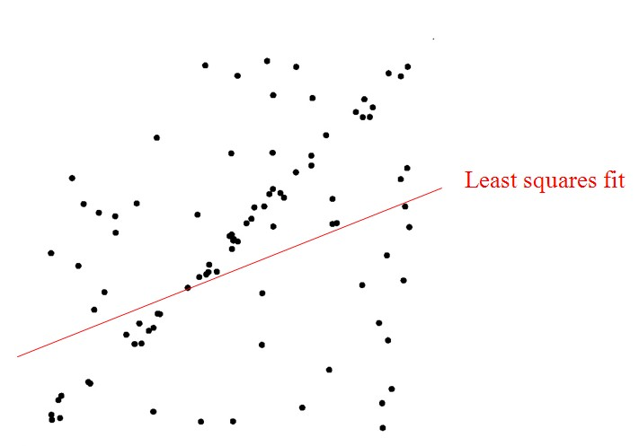

# 随机采样一致

RANSAC是**RAN**dom **SA**mple **C**onsensus（随机抽样一致性）的缩写。它是从一个观察数据集合中，估计模型参数（**模型拟合**）的迭代方法。它是一种随机的不确定算法，每次运算求出的结果可能不相同，但总能给出一个合理的结果，为了提高概率必须提高迭代次数。

### 算法详解

给定两个点p1与p2的坐标，确定这两点所构成的直线，要求对于输入的任意点p3，都可以判断它是否在该直线上。初中解析几何知识告诉我们，判断一个点在直线上，只需其与直线上任意两点点斜率都相同即可。实际操作当中，往往会先根据已知的两点算出直线的表达式（点斜式、截距式等等），然后通过向量计算即可方便地判断p3是否在该直线上。 

生产实践中的数据往往会有一定的偏差。例如我们知道两个变量X与Y之间呈线性关系，Y=aX+b，我们想确定参数a与b的具体值。通过实验，可以得到一组X与Y的测试值。虽然理论上两个未知数的方程只需要两组值即可确认，但由于系统误差的原因，任意取两点算出的a与b的值都不尽相同。我们希望的是，最后计算得出的理论模型与测试值的误差最小。大学的高等数学课程中，详细阐述了最小二乘法的思想。通过计算最小均方差关于参数a、b的偏导数为零时的值。事实上，在很多情况下，最小二乘法都是线性回归的代名词。 

遗憾的是，最小二乘法只适合与误差较小的情况。试想一下这种情况，假使需要从一个噪音较大的数据集中提取模型（比方说只有20%的数据时符合模型的）时，最小二乘法就显得力不从心了。例如下图，肉眼可以很轻易地看出一条直线（模式），但算法却找错了。 

RANSAC算法的输入是一组观测数据（往往含有较大的噪声或无效点），一个用于解释观测数据的参数化模型以及一些可信的参数。RANSAC通过反复选择数据中的一组随机子集来达成目标。被选取的子集被假设为局内点，并用下述方法进行验证： 

- 有一个模型适应于假设的局内点，即所有的未知参数都能从假设的局内点计算得出。
- 用1中得到的模型去测试所有的其它数据，如果某个点适用于估计的模型，认为它也是局内点。
- 如果有足够多的点被归类为假设的局内点，那么估计的模型就足够合理。
- 然后，用所有假设的局内点去重新估计模型（譬如使用最小二乘法），因为它仅仅被初始的假设局内点估计过。
- 最后，通过估计局内点与模型的错误率来评估模型。
- 上述过程被重复执行固定的次数，每次产生的模型要么因为局内点太少而被舍弃，要么因为比现有的模型更好而被选用。

