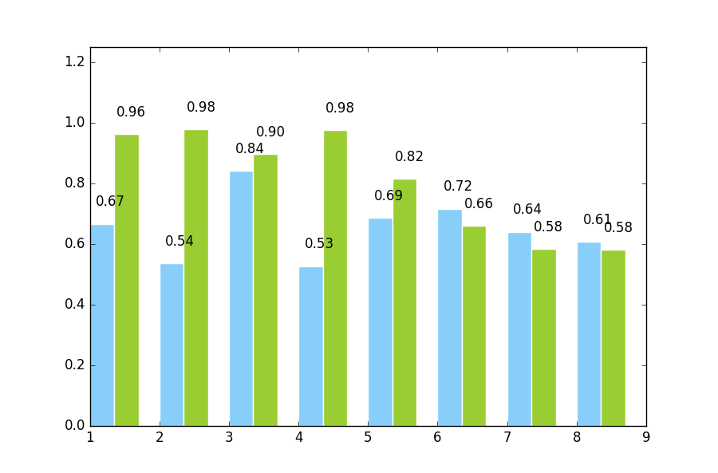
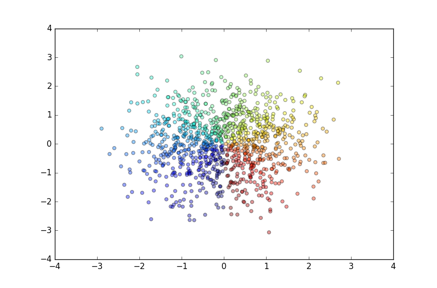

# 常用图形

- 散点图（scatter）
- 折线图（line）
- 柱状图（bar）
- 直方图（histogram）
- 饼状图（pie）
- 箱状图（Box）


### 柱状图

```python
import numpy as np
from matplotlib import pyplot as plt
plt.figure(figsize=(9,6))
n = 8
X = np.arange(n)+1
#X是1,2,3,4,5,6,7,8,柱的个数
# numpy.random.uniform(low=0.0, high=1.0, size=None), normal
#uniform均匀分布的随机数，normal是正态分布的随机数，0.5-1均匀分布的数，一共有n个
Y1 = np.random.uniform(0.5,1.0,n)
Y2 = np.random.uniform(0.5,1.0,n)
plt.bar(X,Y1,width = 0.35,facecolor = 'lightskyblue',edgecolor = 'white')
#width:柱的宽度
plt.bar(X+0.35,Y2,width = 0.35,facecolor = 'yellowgreen',edgecolor = 'white')
#水平柱状图plt.barh，属性中宽度width变成了高度height
#打两组数据时用+
#facecolor柱状图里填充的颜色
#edgecolor是边框的颜色
#想把一组数据打到下边，在数据前使用负号
#plt.bar(X, -Y2, width=width, facecolor='#ff9999', edgecolor='white')
#给图加text
for x,y in zip(X,Y1):
    plt.text(x+0.3, y+0.05, '%.2f' % y, ha='center', va= 'bottom')

for x,y in zip(X,Y2):
    plt.text(x+0.6, y+0.05, '%.2f' % y, ha='center', va= 'bottom')
plt.ylim(0,+1.25)
plt.show()
```




### 散点图

```python
import numpy as np
from matplotlib import pyplot as plt

plt.figure(figsize=(9,6))
n=1000
#rand 均匀分布和 randn高斯分布
x=np.random.randn(1,n)
y=np.random.randn(1,n)
T=np.arctan2(x,y)
plt.scatter(x,y,c=T,s=25,alpha=0.4,marker='o')
#T:散点的颜色
#s：散点的大小
#alpha:是透明程度
plt.show()
```



