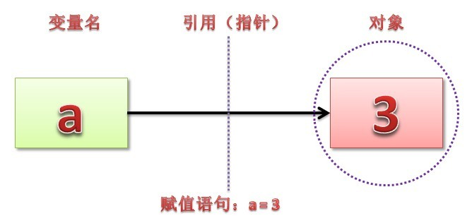
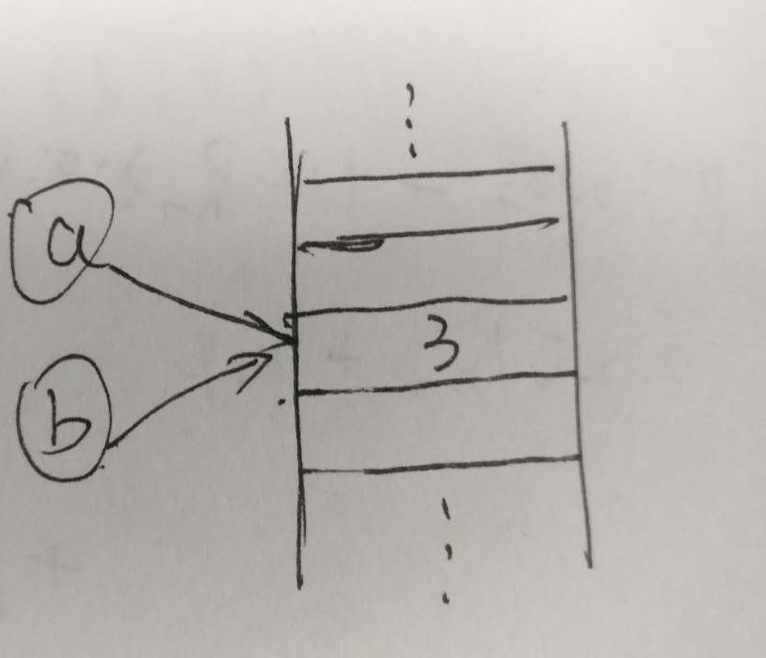

# 变量/对象的操作

### 变量的引用

python不区分变量的定义和赋值 ，赋值语句总是建立对象的引用值，而不是复制对象。因此python变量更像是**指针**，而不是数据存储区域。




### 可变对象&不可变对象

不可变对象：int，float，long，str，tuple等

可变对象：list，set，dict等

```python
>>> a = 'xianglong.me'
>>> id(a)
140443303134352
>>> a = '1saying.com'
>>> id(a)
140443303131776
# 重新赋值之后，变量a的内存地址已经变了
# 如果对a中字符进行修改会产生错误
In [20]: a[2]
Out[20]: 'a'

In [21]: a[2] = 'c'
---------------------------------------------------------------------------
TypeError                                 Traceback (most recent call last)
<ipython-input-21-69ed835eb212> in <module>()
----> 1 a[2] = 'c'

TypeError: 'str' object does not support item assignment

 
>>> a_list = [1, 2, 3]
>>> id(a_list)
140443302951680
>>> a_list.append(4)
>>> id(a_list)
140443302951680
# list重新赋值之后，变量a_list的内存地址并未改变
# [1, 2, 3]是可变的，append操作只是改变了其value，变量a_list指向没有变
# 注意：如果采用以下形式修改a，同样会创建新的对象
In [15]: a = [1,2]

In [16]: id(a)
Out[16]: 1541732275912

In [17]: a = a+[2]

In [18]: id(a)
Out[18]: 1541732113608

```


### 函数参数传值传址问题

```python
def func_int(a):
    a += 4
 
def func_list(a_list):
    a_list[0] = 4
 
t = 0
func_int(t)
print t
# output: 0
 
t_list = [1, 2, 3]
func_list(t_list)
print t_list
# output: [4, 2, 3]
```

第一个例子是传值，而第二个例子是传址，区别在于第一个函数中参数a是一个不可变对象，每一次操作（修改）都会重新建立新的对象；而第二个函数中的参数a_list是可变对象，对它的操作（修改）不会重新建立对象。


###　引用 VS. 浅拷贝 VS. 深拷贝

```python
# 引用
a = 3
b = a
```



浅复制只复制不可变对象（整数，实数，字符串等），对于可变对象，浅复制其实是创建了一个对于该对象的引用，也就是说只是给同一个对象贴上了另一个标签而已。

```python
# 没有限制条件的分片表达式（L[:]）能够复制序列，但此法只能浅层复制。
In [26]: a = [[1, 2, 3], [4, 5, 6]]

In [27]: b = a[:]

In [28]: a[0][0] = 33

In [29]: a, b
Out[29]: ([[33, 2, 3], [4, 5, 6]], [[33, 2, 3], [4, 5, 6]])
# 字典 copy 方法，D.copy() 能够复制字典，但此法只能浅层复制
# copy 标准库模块能够生成完整拷贝：deepcopy 本质上是递归 copy
```


### 增加赋值 VS. 共享引用

x = x + y，x 出现两次，必须执行两次，性能不好，合并必须新建对象 x，然后复制两个列表合并

属于复制/拷贝

x += y，x 只出现一次，也只会计算一次，性能好，不生成新对象，只在内存块末尾增加元素。

当 x、y 为list时， += 会自动调用 extend 方法进行合并运算，in-place change。

属于共享引用

```python
L = [1, 2]
M = L
L = L + [3, 4]
print L, M
print "-------------------"
L = [1, 2]
M = L
L += [3, 4]
print L, M


[1, 2, 3, 4] [1, 2]
-------------------
[1, 2, 3, 4] [1, 2, 3, 4]
```

