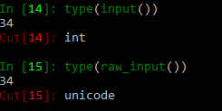
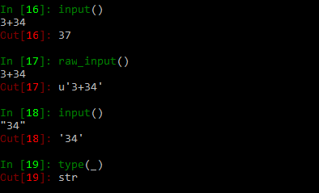

# 各种输入方式的区别

- input()
- raw_input()
- sys.stdin.read()
- sys.stdin.readline( )


```python
"""
1、当输入为纯数字时：
input返回的是数值类型，如int,float
raw_inpout返回的是字符串类型，string类型
"""
```



```python
"""
2、输入字符串为表达式
input会计算在字符串中的数字表达式，而raw_input不会。
如输入“57 + 3”:

input()支持用户输入数字或者表达式，不支持输入字符串，返回的是数字类型的数值。而raw_input()捕获的是最原始的输入，也就是说返回的是一个字符串，所以如果输入的是数字，那么我们必须要进行强制转换。例如：
        a = int(raw_input("Please input the number a:"))
"""
```



```python
>>>msg = input()
   123
>>>msg
   123
>> type(msg)
   <type 'int'>

>>>msg = input()
    abc
会抛出NameError异常
使用input()输入字符串时，需要加上引号'',""
>>>msg = input()
   'abc'
>>>msg
   'abc'
>>>type (msg)
   <type 'str'>
```

raw_input()在命令行接受的输入是原始字符串,返回值是字符串类型数据
比如：

```python
 >>>msg = raw_input()
    123\r\n
 >>>msg
 >>>'123\\r\\n'
 >>>print msg
 123\r\n
 >>>msg = raw_input()
     123
 >>>msg
 '123'
 >>>print msg
 123
```

> raw_input在python3中不存在，只能使用input()

sys.stdin.read()和raw_input()接受和返回的都是原始字符串

区别是raw_input()遇到输入enter停止输入

sys.stdin.read()读取数据 ctrl+d是结束输入 ，read并不会像input那样遇到回车就返回读取的数据它会缓存或者 等到ctrl d再读取数据

sys.stdin.readline( )会将标准输入全部获取，包括末尾的'\n'，因此用len计算长度时是把换行符'\n'算进去了的，但是raw_input( )获取输入时返回的结果是不包含末尾的换行符'\n'的


